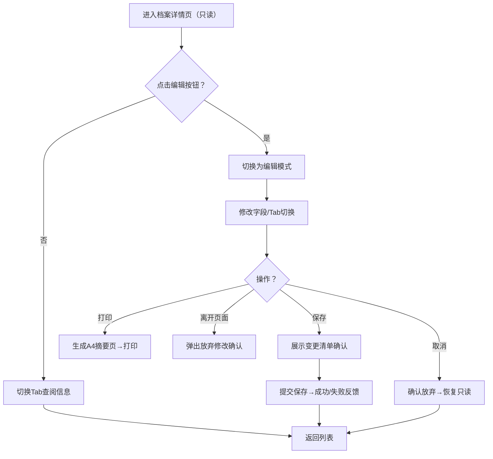

## 1. 产品概述

员工档案详情中心是企业人力资源管理系统的核心模块，提供单个员工完整档案的集中展示与管理能力。通过工号关联基本信息、合同、异动、附件等多维度数据，支持HR人员进行档案维护、查阅和打印操作。

- 主要目的：解决HR查阅/维护员工档案时信息分散、操作繁琐的问题，提供一体化的档案管理体验
- 目标用户：HR专员、部门经理、高管（不同角色拥有不同权限）
- 产品价值：提升档案管理效率，降低信息出错率，确保档案合规完整

## 2. 核心功能

### 2.1 用户角色（权限体系）

| 角色 | 注册方式 | 核心权限 |
|------|----------|----------|
| HR专员 | 系统管理员分配 | 全部档案读写权限 |
| 部门经理 | 系统管理员分配 | 本部门员工档案只读 |
| 高管 | 系统管理员分配 | 全公司档案只读 |

### 2.2 功能模块

1. **快捷操作栏**：编辑/保存/取消按钮、打印档案、返回列表
2. **基本信息Tab**：个人信息字段、工作信息字段、头像上传、变更标记
3. **合同信息Tab**：合同列表、到期预警、详情弹窗、新增合同
4. **异动记录Tab**：变更时间轴、事件类型筛选
5. **附件资料Tab**：分类管理、上传/预览/下载/删除、删除确认
6. **交互组件**：变更清单、离开确认、操作反馈、加载重试

### 2.3 页面详情

| 页面名称 | 模块名称 | 功能描述 |
|----------|----------|----------|
| 档案详情页 | 快捷操作栏 | 顶部固定：编辑/保存/取消/打印/返回；编辑模式切换；显示当前状态 |
| 档案详情页 | Tab容器 | 4个Tab切换（基本信息/合同/异动/附件）；切换时不丢失未保存数据；自适应宽度 |
| 档案详情页 | 基本信息Tab | 个人9字段+工作6字段表单；编辑高亮变更；头像上传裁剪预览；保存前变更清单 |
| 档案详情页 | 合同信息Tab | 合同列表（编号/类型/日期/主体/状态）；30天到期标记；点击弹窗查看详情；新增按钮 |
| 档案详情页 | 异动记录Tab | 时间轴倒序展示（入职/转正/调岗/晋升/离职）；原值→新值/操作人/备注；事件类型筛选器 |
| 档案详情页 | 附件资料Tab | 4类分类标签页（身份证/学历/离职证明/其他）；上传按钮；图片/PDF预览；下载；二次确认删除 |
| 档案详情页 | 通用交互 | 离开页面提示放弃修改；保存成功/失败Toast；加载失败重试按钮 |
| 打印页面 | A4档案摘要 | 自动生成适合A4打印的档案摘要页（基本信息+合同概要+近期异动） |

## 3. 核心流程

**主要用户流程：HR查阅并编辑员工档案**

1. HR从列表页点击某员工 → 进入档案详情页（默认只读模式）
2. HR点击「编辑」按钮 → 切换为编辑模式，所有可编辑字段变为输入框
3. HR切换各个Tab，修改基本信息、新增合同记录等 → Tab切换保留未保存内容
4. 修改字段时 → 变更字段高亮黄色边框，变更清单实时累积
5. HR点击「保存」→ 弹出变更清单确认 → 保存后成功提示，恢复只读模式
6. HR点击「打印档案」→ 新开页面生成A4摘要 → 自动触发浏览器打印
7. 若HR未保存就离开 → 弹出「是否放弃未保存修改」确认

## 4. 用户界面设计

### 4.1 设计风格

- **主色调**：深靛蓝 `#1e3a8a`（专业稳重），辅助色：琥珀橙 `#f59e0b`（变更高亮/提醒），成功绿 `#10b981`，危险红 `#ef4444`
- **按钮风格**：圆角10px，主按钮渐变填充，次要按钮描边，悬停有微妙阴影上浮
- **字体**：标题使用「思源宋体 / Noto Serif SC」彰显正式感；正文使用「思源黑体 / Noto Sans SC」保证可读性；字号层级：12px/14px/16px/20px/28px
- **布局风格**：顶部固定操作栏（磨砂玻璃效果）+ 下方Tab卡片式布局，卡片柔和阴影 `shadow-sm hover:shadow-md`，圆角12px
- **图标风格**：使用 Lucide React 线性图标，统一描边宽度

### 4.2 页面设计概述

| 页面/模块 | 模块名称 | UI元素与风格 |
|-----------|----------|--------------|
| 档案详情页 | 顶部操作栏 | 磨砂背景 `bg-white/80 backdrop-blur`，左侧面包屑+员工名片（头像+姓名+工号+状态徽章），右侧操作按钮组 |
| 档案详情页 | Tab导航 | 下划线式Tab，选中时加粗文字+靛蓝下划线，未选中灰色，悬停浅灰背景 |
| 基本信息Tab | 个人信息区 | 左：头像区（圆形+上传按钮+裁剪浮层）；右：3列栅格表单，Label加粗，编辑模式下输入框靛蓝焦点环 |
| 基本信息Tab | 工作信息区 | 独立卡片，标题栏带分隔线，字段2列栅格，状态/岗位等使用徽章展示 |
| 基本信息Tab | 变更高亮 | 变更字段：琥珀色边框 + 字段右侧「已修改」微标签，鼠标悬停显示原值 |
| 合同信息Tab | 合同列表 | 表格样式，斑马行，到期合同行背景微橙，状态列彩色徽章（生效中/即将到期/已过期） |
| 合同信息Tab | 详情弹窗 | 居中模态框，遮罩模糊，表单式详情，底部操作按钮 |
| 异动记录Tab | 时间轴 | 左侧垂直靛蓝渐变时间线，圆点按事件类型着色，右侧卡片，卡片内信息层次分明 |
| 异动记录Tab | 筛选器 | 顶部胶囊式多选标签（全部/入职/转正/调岗/晋升/离职），选中填充背景 |
| 附件资料Tab | 分类Tab | 次级Tab，分类后显示网格卡片，卡片含缩略图+文件名+操作按钮 |
| 附件资料Tab | 预览浮层 | 全屏半透明遮罩，居中显示图片或PDF，右上角关闭，底部工具栏（下载/删除） |
| 通用组件 | 变更清单抽屉 | 右侧滑出面板，列出所有变更（字段：原值→新值），底部确认保存/继续编辑按钮 |
| 通用组件 | Toast通知 | 右上角，成功绿底白字+勾选图标，失败红底+重试按钮，3-5秒自动消失 |

### 4.3 响应式

- **设计优先级**：桌面端优先（1280px+）
- **平板（768-1279px）**：3列表单降为2列，时间轴卡片宽度自适应
- **移动（<768px）**：1列布局，Tab可横向滚动，操作栏按钮简化为图标
- **触摸优化**：可点击区域≥44x44px，表单间距加大

### 4.4 动效细节

- 页面加载：内容区域卡片依次淡入上移（stagger 80ms）
- Tab切换：内容区域 200ms 平滑淡入
- 按钮悬停：`translateY(-1px)` + 阴影加深
- 时间轴：滚动到视口内时圆点缩放动画
- 模态框/抽屉：`scale-in 200ms cubic-bezier(0.16,1,0.3,1)`
